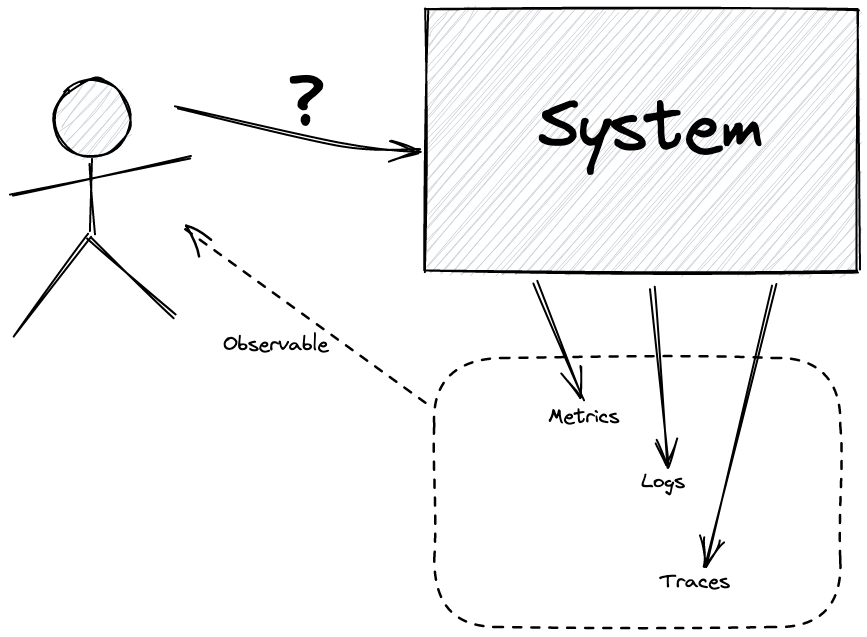
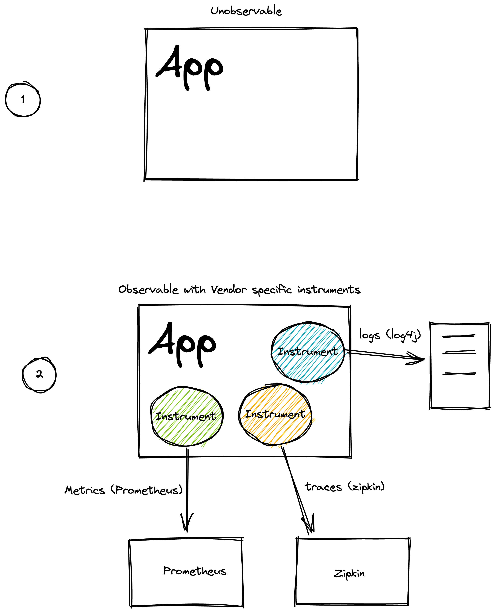
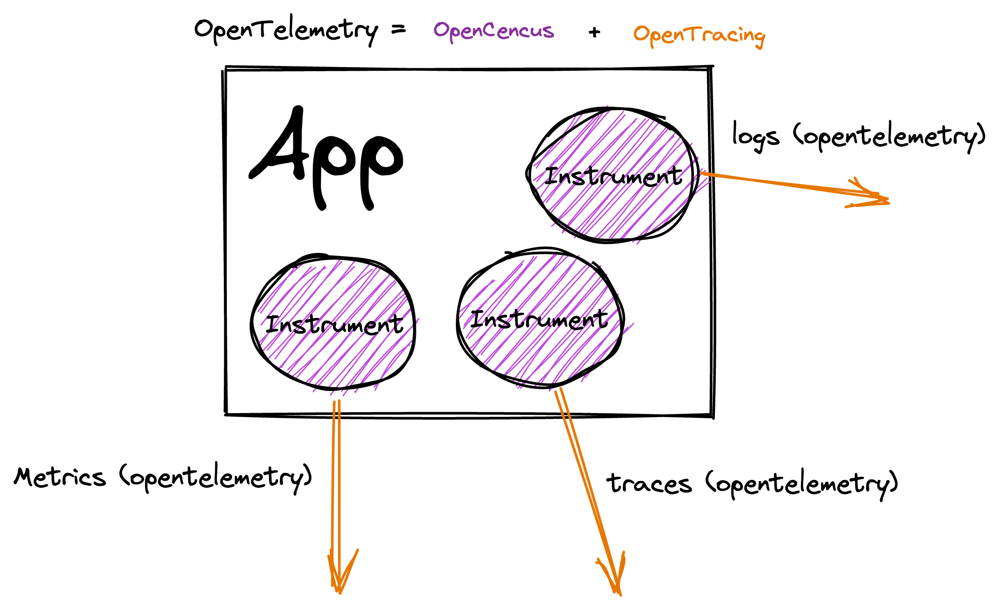
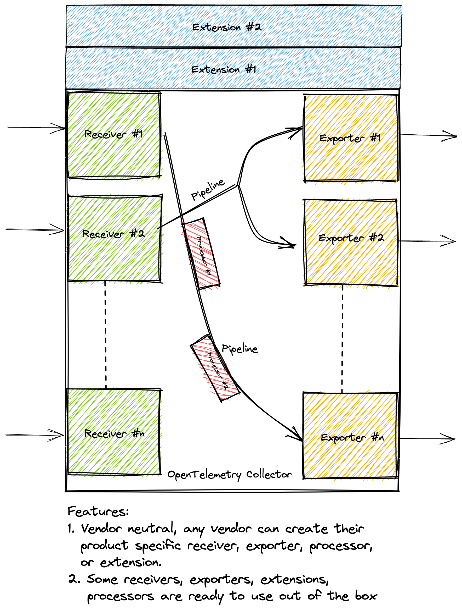
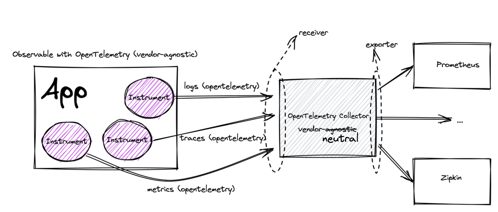

To understand the OpenTelemetry, we need to understand the foundational concept of __Observability__ first.

## Observability

In the modern day distributed micro-service applications, it is increasingly becoming difficult for developers to monitor and systems with multiple dependencies due the sheer scale and diversity of technologies involved in the system.

This brings the need for a standard way to understand the running system in a more scalable way.

> Observability is a methodology to understand a system from the outside without knowing its inner workings.

The system is called __"observable"__, if it the application code is instrumented to emit traces, metrics, and logs.



## Background History of Observability and OpenTelemetry

In the past, there as no standard way in which code was instrumented. And each Observability back-end (Ziplin, Jaeger, Prometheus etc.) had its own instrumentation libraries and agents for emitting data to the tools.

This meant:

1. __Lack of Standardized Format:__ There was no standardized data format for sending data to an Observability back-end.
2. __Lack of Portability:__ If a user chose to switch Observability back-ends, they would have to re-instrument their code and configure new agents to be able to emit telemetry data to the new tool of choice.



Recognizing the need for standardization and portability, the cloud community came together, and two open-source projects were born:

1. __OpenTracing__ (a Cloud Native Computing Foundation (CNCF) project): This provided a vendor-neutral API for sending telemetry data over to an Observability back-end; however, it relied on developers to implement their own libraries to meet the specification.
2. __OpenCensus__ (a Google Open Source community project): This provided a set of language-specific libraries that developers could use to instrument their code and send to any one of their supported back-ends.

To standardize things further, in May 2019, __OpenCensus and OpenTracing were merged to form "OpenTelemetry"__ (OTel for short). As a CNCF incubating project, OpenTelemetry takes the best of both worlds, and then some.



## OpenTelemetry

OpenTelemetry is the mechanism by which application code is instrumented, to help make a system observable.

OTel's goal is to provide a set of standardized vendor-agnostic SDKs, APIs, and tools for ingesting, transforming, and sending data to an Observability back-end (i.e. open-source or commercial vendor).

### OpenTelemetry Signals

In OpenTelemetry, a __Signal__ refers to the categories of telemetry that are supported by the specification. It currently supports the Signals below, and more may be added in the future.

__Traces__ - Traces give us the big picture of what happens when a request is made by user or an application.

__Metrics__ - A metric is a measurement about a service, captured at runtime.

__Logs__ - A log is a timestamped text record, either structured (recommended) or unstructured, with metadata.

__Baggage__ - Baggage refers to contextual information that's passed between spans

### Language specific Instrumentation Libraries (vendor-agnostic)

- [OpenTelemetry code instrumentation is supported for many popular programming languages](https://opentelemetry.io/docs/instrumentation/)
- Some programming languages support both auto-instrumentation and manual instrumentation while others may support only one of them based on language limitations.

Checkout [instrumenting](https://opentelemetry.io/docs/concepts/instrumenting/) for more details.

### Collector (vendor-neutral)

OpenTelemetry Collector (otel-collector) is a vendor-neutral component which allows telemetry data (signals) to be collected, processed upon and exported to an observability backend in their respective formats.

OpenTelemetry Collector can be customized using its configuration, an example configuration would look like:

```yml
receivers:
  otlp:
    protocols:
      grpc:
      http:

processors:
  batch:

exporters:
  otlp:
    endpoint: otelcol:4317

extensions:
  health_check:
  pprof:
  zpages:

service:
  extensions: [health_check,pprof,zpages]
  pipelines:
    traces:
      receivers: [otlp]
      processors: [batch]
      exporters: [otlp]
    metrics:
      receivers: [otlp]
      processors: [batch]
      exporters: [otlp]
    logs:
      receivers: [otlp]
      processors: [batch]
      exporters: [otlp]
```

We can specify "pipelines" in the otel-collector, each for __metrics__, __traces__ and __logs__ which are comprised of:

1. __Receivers:__ A receiver accepts data in a specified format, translates it into the internal format and passes it to processors and exporters defined in the applicable pipelines
2. __Processors:__ A processor pre-processes data before it is exported (e.g. modify attributes or sample) or helps ensure that data makes it through a pipeline successfully (e.g. batch/retry).
3. __Exporters:__ An exporter translates the internal format into another defined format.

__Extensions:__ There is another type of component called "extensions", which provides capabilities on top of the primary functionality of the collector. Generally, extensions are used for implementing components that can be added to the Collector, but which do not require direct access to telemetry data and are not part of the pipelines (like receivers, processors or exporters)

There are 2 flavors of otel-collector present:

- [Core otel-collector](https://github.com/open-telemetry/opentelemetry-collector): This is the standard collector provided by the open-telemetry and have certain receivers, processors, exporters and extensions built-in for any generic usage.
- [otel-collector-contrib](https://github.com/open-telemetry/opentelemetry-collector-contrib): This is a superset of standard otel-collector, this includes open source community contributed components for vendor specific data-formats. Use this if you want to have any vendor-specific observability backends or data sources (instrumentation, applications etc.) to support in your system.



## Conclusion

To conclude this, OpenTelemetry provides robust standards, rich set of libraries for various programming languages, and tools for instrumenting, collecting, transforming and exporting telemetry data to make the system observable.

Here is the general OpenTelemetry workflow diagram:


